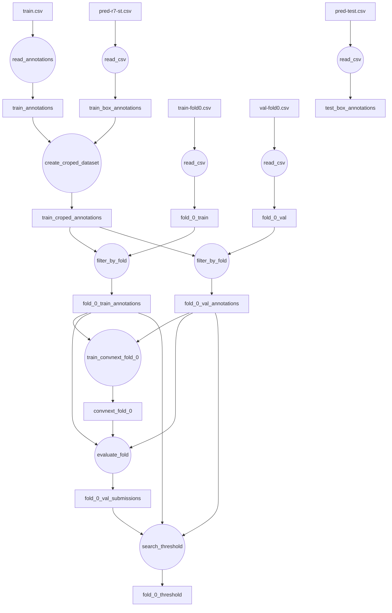

```mermaid
flowchart TB
train.csv --> read_annotations((read_annotations))
read_annotations --> train_annotations
pred-r7-st.csv --> read_csv((read_csv)) --> train_box_annotations
train_annotations --> create_croped_dataset0((create_croped_dataset)) --> train_croped_annotations
train_box_annotations --> create_croped_dataset0
train-fold0.csv --> read_csv0((read_csv)) --> fold_0_train
val-fold0.csv --> read_csv1((read_csv)) --> fold_0_val
train_croped_annotations --> filter_by_fold0((filter_by_fold)) --> fold_0_train_annotations
fold_0_train --> filter_by_fold0
train_croped_annotations --> filter_by_fold1((filter_by_fold)) --> fold_0_val_annotations
fold_0_val --> filter_by_fold1

fold_0_train_annotations --> train0((train_convnext_fold_0))
fold_0_val_annotations --> train0
pred-test.csv --> read_csv2((read_csv)) --> test_box_annotations
train0((train_convnext_fold_0)) --> convnext_fold_0
convnext_fold_0 --> evaluate_fold0((evaluate_fold)) 
fold_0_train_annotations --> evaluate_fold0((evaluate_fold)) --> fold_0_val_submissions
fold_0_val_annotations --> evaluate_fold0
fold_0_val_submissions --> search_threshold((search_threshold)) --> fold_0_threshold
fold_0_val_annotations --> search_threshold
fold_0_train_annotations --> search_threshold
```
