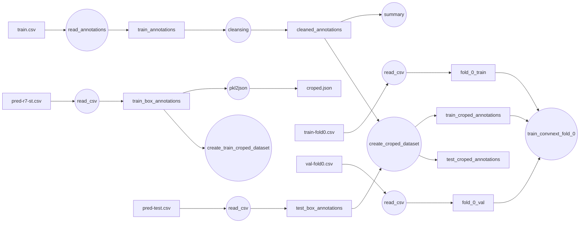

```mermaid
flowchart LR
train.csv --> read_annotations((read_annotations))
read_annotations --> train_annotations
train_annotations --> cleansing((cleansing)) --> cleaned_annotations --> summary((summary))
pred-r7-st.csv --> read_csv((read_csv)) --> train_box_annotations --> pkl2json((pkl2json)) --> croped.json
cleaned_annotations --> create_croped_dataset0((create_croped_dataset)) --> train_croped_annotations
train_box_annotations --> create_train_croped_dataset((create_train_croped_dataset))
train-fold0.csv --> read_csv0((read_csv)) --> fold_0_train
val-fold0.csv --> read_csv1((read_csv)) --> fold_0_val
train_croped_annotations --> train0((train_convnext_fold_0))
fold_0_train --> train0
fold_0_val --> train0
pred-test.csv --> read_csv2((read_csv)) --> test_box_annotations
test_box_annotations --> create_croped_dataset0((create_croped_dataset)) --> test_croped_annotations
```
